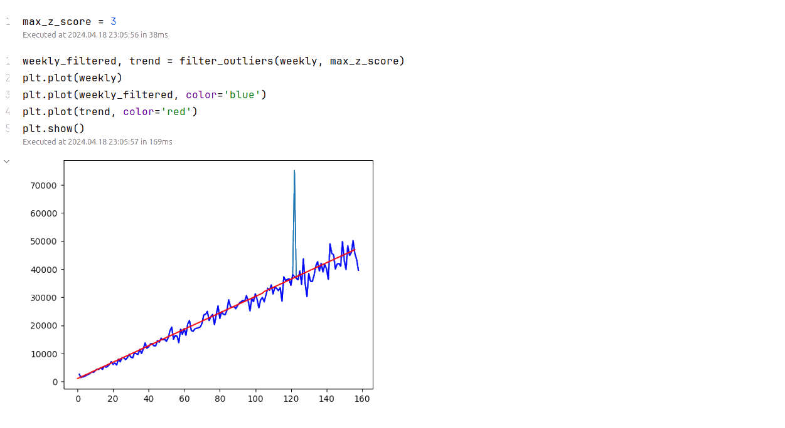
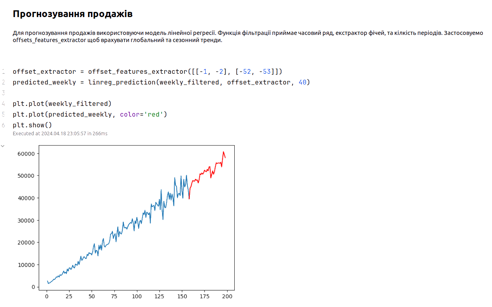
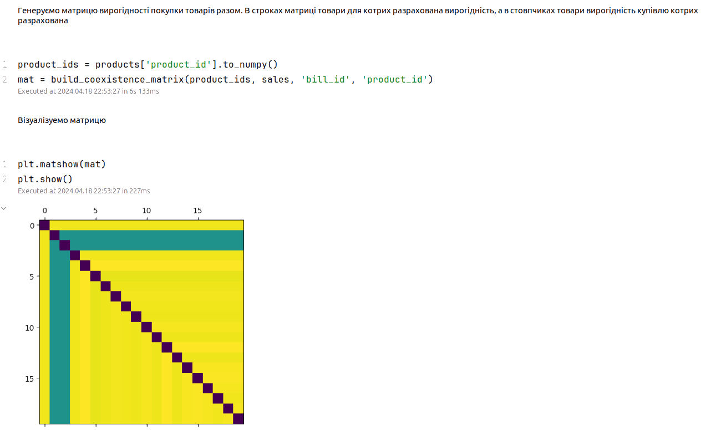
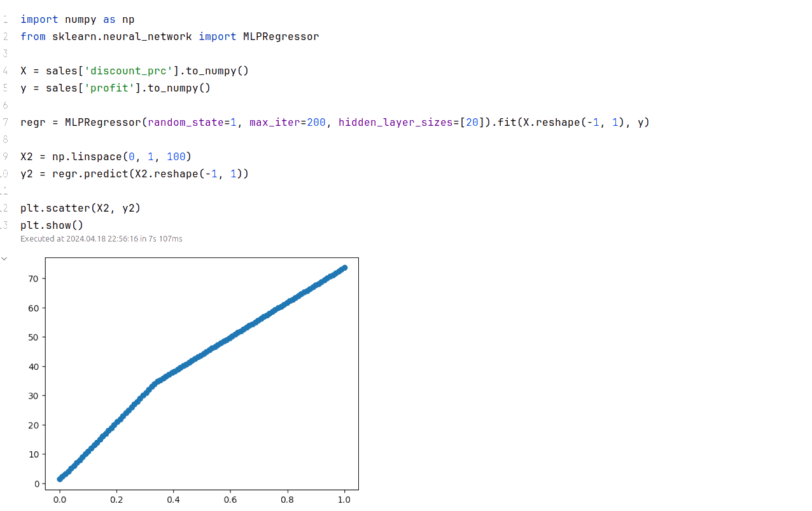
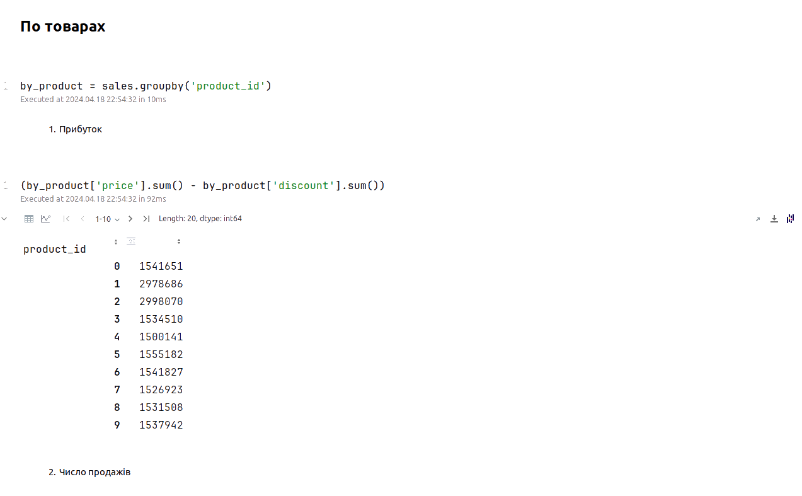

# Система Підтримки Прийнятя Рішень

## Опис
В данному репозіторії реалізована базова версія системи підтримки прийнятя рішень побудованна на базі 
бібліотек аналітики данних для Python. 

В якості інтерфейсу аналітика виступают Jupeter Notebooks.

## Інструменти
Список реалізованих інструментів:
 1. [Прогнозування обсягів продажу](sales_prediction.ipynb)
 2. [Пошук оптимальної торгівельної націнки](trade_margin_analysis.ipynb)
 3. [Аналіз споживчого кошика](cart_analysis.ipynb)
 4. [Аналітична звітність](analytics.ipynb)

## Сховище
Работа зі сховищем реалізованни з використанням бібліотеки Pandas, та підтримує усі типи сховищь яка вона підтримує, 
тобто файли в різних форматах та бази данних.

В данній работі реалізовано сховище данних у вигляді csv файлів. 

Приклад файлів лежить у каталозі [data](data)

Також в репозіторії є генератор тестових данних с можливістю задати глобалний тренд, кілкість товарів та клієнтів, 
а також сімуляції викидів [generator.py](generator.py).

## Скриншоти
Фільтрація вибросів

Прогнозування продажів

Аналіз кошика

Залжність прибутку від знижки

Аналітичні звіти

